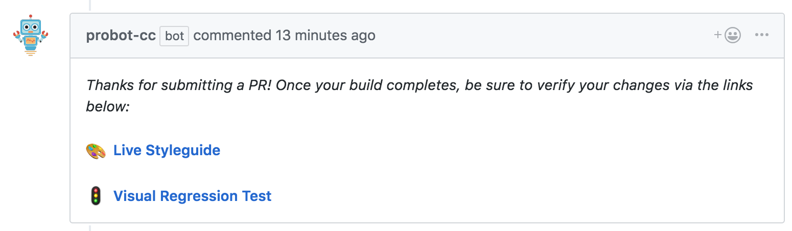

# customizable-comments (probot-cc)

> A GitHub App built with [Probot](https://github.com/probot/probot) that auto-replies with customizable comments based on template vars



## Usage

1. Install the [Customizable Comments GitHub App](https://github.com/apps/probot-cc) into the repos you wish to use it on.
1. Add a `.github/customizable-comments.yml` configuration file to each repo.

## Configuration options

_Currently, this Probot App only supports `pull_request.opened` events._

_I would be happy to add more, just submit a PR or Issue with what you'd find useful._

### Built-in template vars

| name     | value                     | used when      |
| -------- | ------------------------- | -------------- |
| \$BRANCH | The branch name of the PR | `pull_request` |

### Custom template vars

You can configure your own variable replacements using the `vars:` block in the yml file. See the example below:

## Example

```yaml
vars:
  - name: $MY_CUSTOM
    value: my-value

pull_request:
  opened:
    template: |
      Here's a helpful URL based on the branch name: https://$BRANCH.something.example.com
      And here's my custom value: $MY_CUSTOM
```

The above will auto-reply with a comment like so:

```
Here's a helpful URL based on the branch name: https://the-branch.something.example.com
And here's my custom value: my-custom
```

## Local Development

```sh
# Install dependencies
npm install

# Run the bot
npm run dev
```

## Contributing

If you have suggestions for how customizable-comments could be improved, or want to report a bug, open an issue! We'd love all and any contributions.

For more, check out the [Contributing Guide](CONTRIBUTING.md).

## License

[ISC](LICENSE) © 2018 Jeremy Gayed <https://twitter.com/tizmagik>
